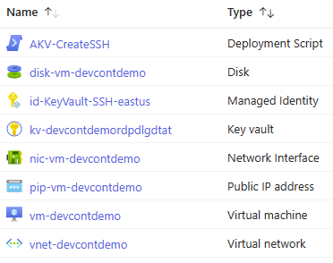
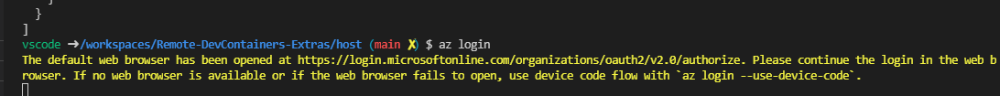
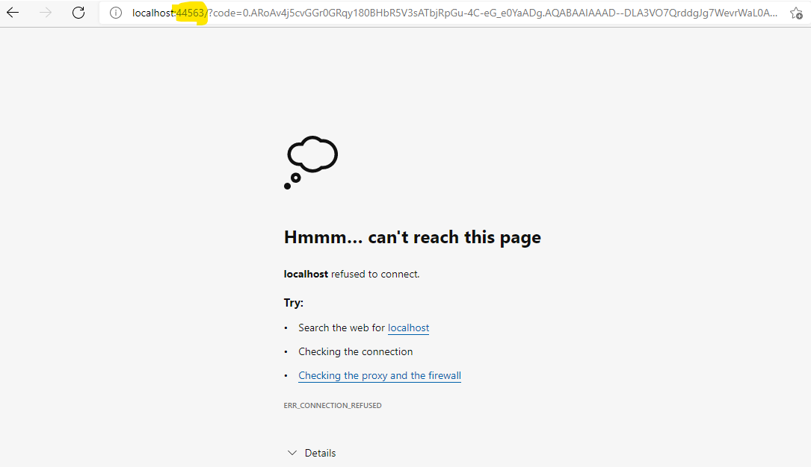
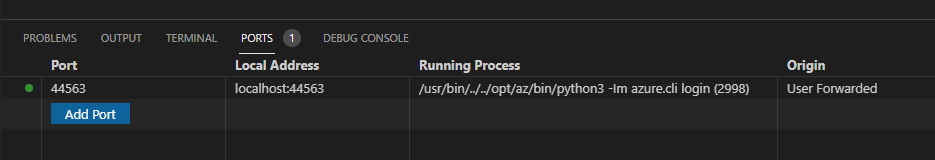

# Overview

The below steps will deployment an Azure environment using a Virtual Network for hosting a private virtual machine and using a VPN Gateway to create a secure private environment for development where developers can use dev containers on VS Code.

## Prerequisites

- Azure Subscription for hosting the dev container hosts.
- [VS Code](https://code.visualstudio.com/)
- VS Code Extensions able to be installed on the developer desktop and dev container host.
- Access to setup ```ssh-agent``` on developer desktop/laptop
- Azure [cli](https://docs.microsoft.com/cli/azure/) and [bicep](https://docs.microsoft.com/azure/azure-resource-manager/bicep/overview?tabs=bicep) installed

## Scenarios

This is a simple "over the internet" scenario which is great for rapid development by a single developer. For private networking scenarios see [Mark's repo](https://github.com/fireblade95402/Linux-DevContainers-in-Azure).

## Public Scenario

For simple, cost optimised scenarios the Virtual Machine powering the Dev Container experience can be exposed to the internet directly. An SSH key pair is used to secure access, and a Just In Time rule can be leveraged in the subnet Network Security Group to restrict access to just the calling IP address.

### Deploy the Azure Infrastructure

#### With PowerShell

```powershell
#Create resource group
$rg="YourResourceGroup"
az group create -g $RG -l uksouth

#Gather local info
$deployingUserId=az ad signed-in-user show --query id --out tsv
$deployingUserName=az ad signed-in-user show --query givenName --out tsv
$clientPublicIp=(Invoke-WebRequest -uri "https://api.ipify.org/").Content

#Deploy to azure
az deployment group create -n devcontdemo -g $RG -f .\bicep\main.bicep -p resourceName=devcontdemo deployingUserPrincipalId=$deployingUserId deployingUserName=$deployingUserName exposureModel=PublicIpOnVm clientOutboundIpAddress=$clientPublicIp
az deployment group show -g $RG -n devcontdemo

#Gather deployment outputs for next step
$vmName=az deployment group show -g $RG -n devcontdemo --query properties.outputs.vmName.value -o tsv
$vmDns=az deployment group show -g $RG -n devcontdemo --query properties.outputs.publicIpDnsFqdn.value -o tsv
$kvName=az deployment group show -n devcontdemo -g $RG --query properties.outputs.keyVaultName.value -o tsv
$sshKey=az keyvault secret show --vault-name $kvName -n vmSshPrivate --query value -o tsv
```

The following resources should have been created in Azure;



### Local workstation configuration

This PowerShell script will download the public key needed for SSH, and will test that the VM is accessible.

```powershell
cd $env:userprofile
mkdir .ssh -ErrorAction SilentlyContinue
$sshKey | out-file ".ssh\$vmName.pub"

Get-Service ssh-agent
start-service ssh-agent
ssh-add "$env:userprofile\.ssh\$vmName.pub"
Test-NetConnection $vmDns -Port 22
```

## Process to connect to a DevContainer

Connect to the remote host using ssh (e.g. azureuser@1.2.45.6) by running command:
  ```Remote-SSH: Connect to Host```
  

## Links

- [Developing inside a Container](https://code.visualstudio.com/docs/remote/containers)
- [Create a development container](https://code.visualstudio.com/docs/remote/create-dev-container)
- [dev container.json reference](https://code.visualstudio.com/docs/remote/devcontainerjson-reference)
- [Connect to remote Docker over SSH](https://code.visualstudio.com/docs/containers/ssh)
- [Generate a new SSH Key and adding it to the ssh-agent](https://docs.github.com/en/authentication/connecting-to-github-with-ssh/generating-a-new-ssh-key-and-adding-it-to-the-ssh-agent)

## Troubleshooting

- If you battle to SSH into the VM with an error related to man in the middle attack. Check the .ssh/known_hosts file for an entry for the same IP address. If so, delete the entry.
- When logging in to Azure via cli (az login) you might get an error with a redirect. Look at the page and add the port highlighted to PORT forwarding. (e.g. Port 44563 -> localhost:44563)
  - Login with ```az login```:
    - 
  - Login with your azure account when prompted.
  - Page can't be reached error could to shown:
    - 
  - Need to add port forwarding for the port highlighted above:
    - 
  - The page can't be reached with refresh automatically and log in once the port has been forwarded.
  - **Note:** The port will change every time you login.
- SSH Authentication issues with Azure DevOps
  - Add a SSH key to the dev container (.ssh) and to Azure DevOps. Plus run the ```ssh-add <.ssh/is_rsa>``` statement to link the key correctly
  